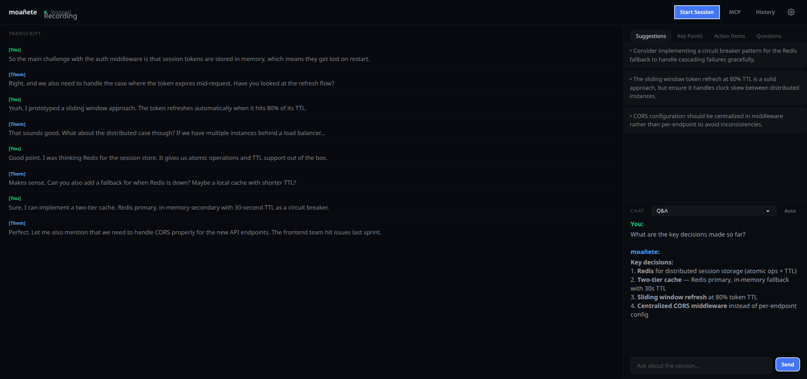
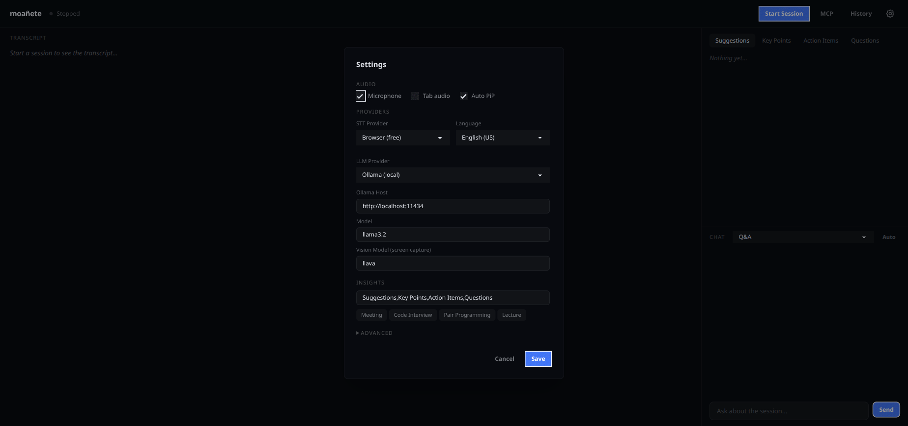

# moañete

**Real-time AI assistant for anything you can hear or see** — transcription, insights, and Q&A, all from your browser.

> **Moañete** — from the Guarani language: *confirmar / fazer ser verdade*. Used when persuasion is based on proving that something is real or correct.



## Table of Contents

- [Quick Start](#quick-start)
- [What does it do?](#what-does-it-do)
- [Use cases](#use-cases)
- [Screenshots](#screenshots)
- [Setup options](#setup-options)
- [Provider options](#provider-options)
- [MCP Integration](#mcp-integration)
- [Configuration](#configuration)
- [Browser compatibility](#browser-compatibility)
- [Troubleshooting](#troubleshooting)
- [Privacy](#privacy)
- [Development](#development)

## Quick Start

> **You need:** [Docker](https://docs.docker.com/get-docker/) installed and running.

```sh
git clone https://github.com/vzsoares/moanete.git
cd moanete
docker compose --profile ollama up --build
```

Open **http://localhost:5173** in **Chrome**. That's it.

The first run downloads AI models (~2-4 GB), so it takes a few minutes. After that, starts are fast.

<details>
<summary>With NVIDIA GPU (faster)</summary>

```sh
docker compose --profile ollama -f docker-compose.yml -f docker-compose.gpu.yml up --build
```

Requires [NVIDIA Container Toolkit](https://docs.nvidia.com/datacenter/cloud-native/container-toolkit/install-guide.html).

</details>

<details>
<summary>Without Docker (manual setup)</summary>

Requires [Bun](https://bun.sh) and **Chrome 116+**.

```sh
git clone https://github.com/vzsoares/moanete.git
cd moanete
bun install
bun run dev           # opens at http://localhost:5173
```

This runs the web app only. For AI features, add [Ollama](https://ollama.com):

```sh
ollama serve
ollama pull llama3.2
```

The app auto-detects Ollama at `localhost:11434`. No config needed.

</details>

<details>
<summary>What's running behind the scenes</summary>

| Service | URL | What it does |
|---------|-----|--------------|
| Web app | http://localhost:5173 | The moañete interface |
| Whisper | http://localhost:8000 | Converts speech to text (locally) |
| Ollama | http://localhost:11434 | AI model for insights and chat (locally) |
| MCP bridge | ws://localhost:3001 | Optional — lets AI coding assistants read your session |

</details>

<details>
<summary>Useful Docker commands</summary>

```sh
docker compose up -d              # run in background
docker compose logs -f app        # follow app logs
docker compose down                # stop everything
docker compose down -v             # stop and delete downloaded models
```

</details>

## What does it do?

moañete listens to your mic, your browser tab audio, or both, transcribes everything in real time, and uses AI to extract insights while it happens. It can also see your screen. It runs entirely in your browser — no moañete-owned server required.

**Key features:**
- Live transcript with speaker labels (You / Them)
- AI-generated insights every ~15 seconds (fully customizable categories)
- Chat with presets — Q&A, Meeting briefing, Code Interview coach, LeetCode coach/solver, Lecture notes, or custom prompts
- Auto-assist mode — AI monitors the session and speaks up only when relevant
- Screen capture + analysis — captures what's on screen (code, slides, exams, whiteboard) and feeds it into the AI context
- Floating Picture-in-Picture overlay so you can keep working while the AI watches
- Session history — review, export, or resume past sessions
- Fully local and free with Ollama + Whisper, or bring your own API keys (OpenAI, Anthropic, Deepgram)

## Use cases

moañete is not just a meeting tool. It listens to any audio your browser can capture and sees your screen.

| Use case | What to do | Recommended preset |
|----------|-----------|-------------------|
| **LeetCode / competitive programming** | Share your screen, get algorithm hints or full solutions | LeetCode Coach / Solve |
| **Coding interviews** | Capture mic + tab, get real-time coaching on your interview process | Code Interview |
| **Exams / online assessments** | Share your screen, ask questions about what's displayed | Q&A + screen capture |
| **Online lectures** | Capture tab audio, get study notes and key concepts | Lecture |
| **Meetings** | Capture mic + tab audio, get action items and key points | Meeting |
| **Pair programming** | Capture mic, get bugs, design decisions, and TODOs | Pair Programming |
| **YouTube / podcasts / audiobooks** | Capture tab audio, get transcripts and summaries | Q&A |
| **Anything with audio or screen** | Capture tab, mic, or both + screen share | Custom prompt |

## Screenshots


*Full dashboard with transcript and AI-generated insights*


*Provider configuration — choose local or cloud AI*

## Setup options

### Step by step

1. Open moañete in Chrome
2. Click **Start Session** — allow mic and/or share a tab/screen
3. The PiP overlay opens so you can keep working in another window
4. Transcript and insights update automatically
5. Pick a **chat preset** or ask questions in Q&A mode
6. Enable screen capture to give the AI visual context (code on screen, slides, exam questions)

## Provider options

| | Local (free) | External (BYOK) |
|---|---|---|
| **STT** | Browser SpeechRecognition, local Whisper server | OpenAI Whisper, Deepgram |
| **LLM** | Ollama | OpenAI, Anthropic |

No moañete-owned server required — all API calls go directly from the browser to your chosen provider.

For local STT via Whisper (needed for tab/system audio transcription):

```sh
just whisper              # uses 'base' model, runs at http://localhost:8000
just whisper large-v3     # use a bigger model for better accuracy
```

For local LLM via Ollama:

```sh
# Install from https://ollama.com, then:
ollama serve
ollama pull llama3.2
```

## MCP Integration

moañete speaks [Model Context Protocol](https://modelcontextprotocol.io) — it can both expose your session to AI assistants and connect to external MCP servers for extended context.

### MCP Server (expose your session)

```sh
just mcp   # start MCP server (stdio + ws://localhost:3001)
```

Add to your Claude Code config (`.claude/settings.json`):
```json
{
  "mcpServers": {
    "moanete": {
      "command": "bun",
      "args": ["src/mcp/server.ts"],
      "cwd": "/path/to/moanete"
    }
  }
}
```

**Tools:** `get_transcript`, `get_insights`, `get_summary`, `ask_question`
**Resources:** `moanete://transcript`, `moanete://insights`, `moanete://status`

### MCP Client (connect external servers)

moañete can connect to external MCP servers (like Notion) for extended context during sessions.

Configure in `mcp-servers.json`:
```json
{
  "mcpServers": {
    "notion": {
      "command": "npx",
      "args": ["-y", "@notionhq/notion-mcp-server"],
      "env": {
        "OPENAPI_MCP_HEADERS": "{\"Authorization\": \"Bearer YOUR_NOTION_TOKEN\", \"Notion-Version\": \"2022-06-28\"}"
      }
    }
  }
}
```

Start the MCP server (`just mcp`), then click the **MCP** button in the navbar to browse connected servers and call their tools from the app.

<details>
<summary><h2>Configuration</h2></summary>

Settings are configured in the app and stored in `localStorage`.

| Setting | Default | Options |
|---------|---------|---------|
| STT Provider | Browser (free) | `browser`, `whisper`, `openai-whisper`, `deepgram` |
| LLM Provider | Ollama (local) | `ollama`, `openai`, `anthropic` |
| Vision Model | llava | Ollama vision model for screen capture (`llava`, `moondream`, `llama3.2-vision`) |
| Insight Tabs | Suggestions, Key Points, Action Items, Questions | Any comma-separated list |
| Capture Mic | On | Toggle |
| Capture Tab Audio | Off | Toggle |

### Insight tab presets

| Context | Categories |
|---------|------------|
| Meeting (default) | Suggestions, Key Points, Action Items, Questions |
| Code Interview | Solution Approach, Complexity Analysis, Edge Cases, Code Suggestions |
| Pair Programming | Bugs, Design Decisions, TODOs, Questions |
| Lecture | Key Concepts, Examples, Questions, References |

</details>

## Browser compatibility

**Chrome/Edge** is recommended — it has full support for all features (PiP overlay, speech recognition, system audio capture).

| Feature | Chrome/Edge | Firefox | Safari |
|---------|-------------|---------|--------|
| Speech-to-text | Full | Behind flag | Partial |
| System/tab audio | Full | Linux only (PipeWire) | No |
| PiP overlay | Full (116+) | No | No |

The app detects your browser and shows hints when features are limited.

## Troubleshooting

| Problem | Cause | Fix |
|---------|-------|-----|
| "Waiting for speech..." but no transcript | Mic permission denied or wrong STT provider | Check browser permissions. Try the `browser` STT provider first. |
| Insights and chat don't work | No LLM configured or Ollama not running | Run `ollama serve && ollama pull llama3.2`, or add an OpenAI/Anthropic API key in Settings. |
| First Docker start is slow | AI models downloading (~2-4 GB) | Wait for the download to complete. Subsequent starts are fast. |
| PiP overlay doesn't open | Browser doesn't support Document PiP | Use Chrome or Edge 116+. Firefox and Safari don't support this API. |

## Privacy

### With local providers (Ollama + Browser STT)
- **Audio** — captured by browser, transcribed locally via SpeechRecognition or sent to your own STT provider
- **Transcripts** — sent only to your configured LLM provider (Ollama = local)
- **API keys** — stored locally in `localStorage`, never sent to us

When using cloud providers (Anthropic, OpenAI, Deepgram), data is sent to their APIs.

## Development

Requires [Bun](https://bun.sh).

```sh
bun install
bun run dev           # vite dev server → http://localhost:5173
bun run build         # production build
bun run check         # biome lint + format check
bun run fix           # biome auto-fix
```

### Tech stack

- **Bundler**: Vite
- **Runtime / Package manager**: Bun
- **Linter / Formatter**: Biome
- **CSS**: Tailwind CSS v4 + DaisyUI v5 + tw-animate-css

### Project structure

```
├── index.html                     # Single-page app entry point
├── justfile                       # Task runner (just dev, just whisper, etc.)
├── mcp-servers.json               # External MCP server config (Notion, etc.)
├── .github/workflows/ci.yml      # GitHub Actions CI
├── scripts/
│   └── whisper-server.py          # Local Whisper STT server (uv run)
└── src/
    ├── mcp/                       # MCP server + client + WebSocket bridge
    ├── core/                      # Audio capture, analyzer, session, config, storage
    ├── providers/
    │   ├── stt/                   # STT: browser (free), whisper (local), openai-whisper, deepgram
    │   └── llm/                   # LLM: ollama, openai, anthropic
    └── ui/
        ├── global.css             # Tailwind + DaisyUI + tw-animate-css
        ├── pip.ts                 # PiP overlay (chat, presets, screen capture, context indicator)
        └── components/            # Web components (mn-dashboard, mn-chat, mn-insights, etc.)
```

## License

[MIT](LICENSE)
